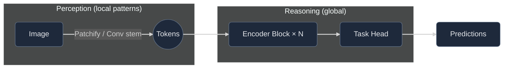
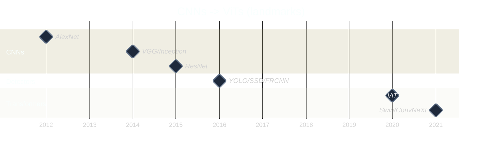

# Are Convolutional Neural Networks dead? Long live CNNs!

Transformers look like the default in **2025**, sure. But every time I try to ship something on a tiny CPU budget or a finicky edge device, I remember why **convolutions** still slap. This post is my quick tour — not a paper, just the way I explain it when someone asks, “So… are CNNs over?”

---

## The CNN Years

I still remember when **AlexNet** blew up ImageNet in 2012. It felt like someone opened a window in a stale room — suddenly GPUs mattered for vision, and everyone started stacking convs like LEGO. Then came **VGG** (make it deeper), **Inception** (make it smarter), **ResNet** (make it _actually_ train), and **YOLO**, which, honestly, was the first time object detection felt like something you could train on a weeknight without crying.

What made **YOLO** special wasn't just speed; it was the vibe. Open weights, simple configs, “here’s how you fine-tune on _your_ stuff.” You didn’t need a cluster — just a plan and a bit of stubbornness.

But there was always a silent villain: **the dataset**.

If your dogs are outnumbered by cats **1 to 9**, the model learns “four legs → probably a cat,” and you still get **90% accuracy**. Gold star on the benchmark, paper accepted — and then it fails the first time someone brings in a corgi. When classes get fuzzy (_predator vs prey_), “worldwide dataset” usually means “European forest because that’s what we had.” The first kangaroo and your model just stares.

And labeling? That’s the tax you pay for supervised learning. Boxes, masks, attributes — hours of human effort per thousand images. One sloppy bounding box and your precision quietly slides.

---

## Why convolutions still feel right (often)

Convs are like good habits: small, local, repeated. They don’t try to understand the whole image at once; they build up from edges → corners → parts → things. That bias is a feature, not a bug — especially when you care about **latency**, **memory**, and **predictability**.

Here’s the tiny formula that defines them:

$$
O(i,j) = \sum_{u,v} K(u,v) \cdot I(i-u, j-v)
$$

A classic edge-detection kernel:

$$
\begin{bmatrix}
-1 & -1 & -1 \\\\
 2 &  2 &  2 \\\\
-1 & -1 & -1
\end{bmatrix}
$$

That’s it — multiply local pixels by a small pattern and sum them up. Stack enough of those and you’ve got most of early-stage computer vision. It’s beautifully dumb, and it works.

If you’re shipping to a small CPU budget or an edge GPU, a well-tuned CNN still feels like cheating: low latency, stable memory, and mature deployment paths (quantization, compilers, kernels). For many “bread-and-butter” tasks, that’s all you need.

---

## What Transformers change

Transformers don’t start local — they look _everywhere_ at once. That’s amazing when the task is global: documents, long-range structures in medical scans, remote sensing, video. They also scale beautifully with data and pretraining. If you can borrow a big backbone, they transfer like champs.

Do they have downsides? Of course. They like data (or big pretraining), and they ask more from your hardware. If your latency budget is “as low as a coffee machine microcontroller,” you’ll feel it.

---

## Why CNNs didn’t stay on top

CNNs didn’t “lose”; they just **hit their ceiling** on certain problems.

- **Global reasoning is hard with only local filters.** Receptive fields grow with depth, but long-range dependencies remain clunky to learn.
- **Scaling by depth/width has diminishing returns.** Beyond a point, you pay a lot of FLOPs for a tiny bump.
- **Transfer learning plateaus.** A CNN pretrained on ImageNet helps, but if your downstream task diverges (documents, aerial, medical), the boost flattens.
- **Transformers unlocked data at scale.** Self-attention + massive pretraining (and often multimodal corpora) made generalization easier across domains.

Short version: CNNs are **specialists** with strong inductive bias; Transformers are **generalists** that see the whole picture.

---

## Hybrids: the middle path that actually ships

Pure attention everywhere isn’t mandatory. A lot of modern vision backbones blend ideas:

- **Conv stem + attention blocks.** Keep locality up front, reason globally later.
- **Windowed or hierarchical attention.** Act local-mostly, global-when-needed.
- **CNNs with “Transformer tricks”.** Layer norms, large kernels, better training schedules.

**Why hybrids win in practice**

- Better **latency** than pure ViT on edge, better **accuracy** than pure CNN on global tasks.
- Easier **training stability** than early ViTs, simpler **deployment** than monster backbones.
- Plays nicely with **quantization** and existing inference runtimes.

If you like names, think families like _Swin_, _ConvNeXt_, _CoAtNet_, and other conv–attention mashups. Labels aside, the recipe is the same: **local bias + global context**.

---

## Performance & efficiency (the pragmatic bit)

Attention loves tokens; cost grows with them.

- **Convolution**: cost grows roughly with image size and kernel size; predictable memory; highly optimized kernels.
- **Self-attention**: **quadratic** in tokens for vanilla attention; great global context, but watch your **latency** and **RAM**.

**Edge device cheat sheet**

  <table className="min-w-full text-sm">
    <thead className="text-slate-200">
      <tr>
        <th className="text-left py-2 px-3">Concern</th>
        <th className="text-left py-2 px-3">CNN</th>
        <th className="text-left py-2 px-3">Transformer</th>
      </tr>
    </thead>
    <tbody className="text-slate-300">
      <tr className="border-t border-slate-700/40">
        <td className="py-2 px-3">Latency (CPU)</td>
        <td className="py-2 px-3">✅ Usually lower</td>
        <td className="py-2 px-3">⚠️ Often higher without tricks</td>
      </tr>
      <tr className="border-t border-slate-700/40">
        <td className="py-2 px-3">Memory spikes</td>
        <td className="py-2 px-3">✅ Stable</td>
        <td className="py-2 px-3">⚠️ Can spike with tokens</td>
      </tr>
      <tr className="border-t border-slate-700/40">
        <td className="py-2 px-3">Quantization</td>
        <td className="py-2 px-3">✅ Mature toolchains</td>
        <td className="py-2 px-3">↔️ Getting better, still picky</td>
      </tr>
      <tr className="border-t border-slate-700/40">
        <td className="py-2 px-3">Small datasets</td>
        <td className="py-2 px-3">✅ Strong inductive bias helps</td>
        <td className="py-2 px-3">⚠️ Prefers pretraining</td>
      </tr>
      <tr className="border-t border-slate-700/40">
        <td className="py-2 px-3">Global context</td>
        <td className="py-2 px-3">↔️ Limited without tricks</td>
        <td className="py-2 px-3">✅ Native strength</td>
      </tr>
    </tbody>
  </table>

**When a small Transformer is fine:** you have a GPU budget, work with documents/remote sensing, or can reuse a strong pretrained backbone.
**When a CNN/hybrid is smarter:** tight latency/power, tiny datasets, or you need predictable memory and easy deployment.

---

## A tiny “see it” moment

Edge detection is one of the first things a CNN learns. Even a simple Sobel filter will highlight contours — proof that _local structure_ still tells a story. Transformers may reason globally, but that first act of perception still starts with patterns and contrast.

That’s why inductive biases matter: a CNN can be _really_ good at noticing consistent local cues, fast.

---

## Multimodality (where Transformers really flex)

Pair images with text, audio, or telemetry streams and Transformers feel at home. Learning a shared space where “this picture ↔ that caption” makes sense unlocks zero-shot classification, search, and all sorts of clever tricks. CNNs can participate (hybrids!), but the global reasoning and token-based nature of Transformers make it feel effortless.

---

## “Okay, what should I use?”

- **Tight latency / small device / small labeled data** → Start with a **CNN** or a **hybrid conv-stem**.
- **Global context / long-range structure / large pretraining available** → Reach for a **Transformer**.
- **Unclear?** Try a **small hybrid** first (conv stem + attention blocks). It’s a solid Pareto move.

And remember: architecture choice rarely saves a broken dataset. Fix your sampling, balance your classes, and evaluate like a cynic.

---

## A quick timeline

---

## Closing thought

CNNs aren’t dead — they’re **specialists**. Transformers are **generalists** that scale and mix modalities. If you can pretrain big and need global reasoning, go Transformer. If you’re shipping something scrappy and fast on the edge, a tidy CNN is still the pragmatic win.

Most of the time, the best answer is a small, boring **hybrid** that respects your budget and your data.
