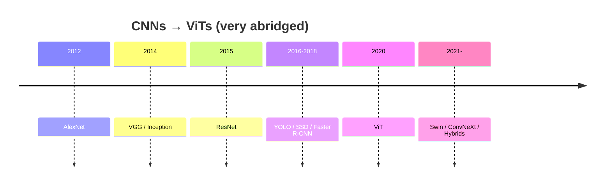

import { Image } from "astro:assets";
import KernelPlayground from "../../../components/KernelPlayground.astro";
import catRawImage from "../../images/are_cnn_dead/cat_raw.webp";

# Are Convolutional Neural Networks dead? Long live CNNs!

## Debug Info

Let's first check if the image imports correctly:

<Image src={catRawImage} alt="Test cat image" />

Now let's see what the import actually contains:

<pre>{JSON.stringify(catRawImage, null, 2)}</pre>

## Testing the Component

### Test 1: With imported image object
<KernelPlayground src={catRawImage} size={5} preset="Identity" />

### Test 2: With a known working external URL
<KernelPlayground src="https://picsum.photos/400/300" size={5} preset="Sobel Y" caption="External image test" />

### Test 3: Display the raw image path
Raw image path from import: {catRawImage?.src || catRawImage?.default || "No src found"}

---

# Are Convolutional Neural Networks dead? Long live CNNs!

Transformers look like the default in **2025**, sure. But every time I try to ship something on a tiny CPU budget or a finicky edge device, I remember why **convolutions** still slap. This post is my quick tour: not a paper, just the way I explain it to friends when they ask, "So… are CNNs over?"

---

## The CNN Years

I still remember when **AlexNet** blew up ImageNet in 2012. It felt like someone opened a window in a stale room — suddenly GPUs mattered for vision, and everyone started stacking convs like LEGO. Then came **VGG** (make it deeper), **Inception** (make it smarter), **ResNet** (make it _actually_ train), and **YOLO**, which, honestly, was the first time object detection felt like something you could train on a weeknight without crying.

What made **YOLO** special wasn't just speed; it was the vibe. Open weights, simple configs, "here's how you fine-tune on _your_ stuff." You didn't need a cluster — just a plan and a bit of stubbornness.

But there was always a silent villain: **the dataset**.

If your dogs are outnumbered by cats **1 to 9**, the model learns "four legs → probably a cat," and you still get **90% accuracy**. Gold star on the benchmark, paper accepted — and then it fails the first time someone brings in a corgi. When classes get fuzzy (_predator vs prey_), "worldwide dataset" usually means "European forest because that's what we had." The first kangaroo and your model just stares.

And labeling? That's the tax you pay for supervised learning. Boxes, masks, attributes — hours of human effort per thousand images. One sloppy bounding box and your precision quietly slides.

---

## Why convolutions still feel right (often)

Convs are like good habits: small, local, repeated. They don't try to understand the whole image at once; they build up from edges → corners → parts → things. That bias is a feature, not a bug — especially when you care about **latency**, **memory**, and **predictability**.

  
<strong>Show the compact formula</strong> (blink and you miss it)

The convolution at location $(i,j)$ is

$$O(i,j) = \sum_{u,v} K(u,v) \cdot I(i-u, j-v)$$

A classic horizontal-edge kernel you may have seen:

$$
\begin{bmatrix}
-1 & -1 & -1 \\
 2 &  2 &  2 \\
-1 & -1 & -1
\end{bmatrix}
$$

**Try it yourself — tweak a kernel and watch the image change:**

<KernelPlayground src={catRawImage.src} size={3} preset="Sobel Y" caption="String URL test" />

If you're shipping to a small CPU budget or an edge GPU, a well-tuned CNN still feels like cheating: low latency, stable memory, and mature deployment paths (quantization, compilers, kernels). For many "bread-and-butter" tasks, that's all you need.

---

## What Transformers change

Transformers don't start local — they look _everywhere_ at once. That's amazing when the task is global: documents, long-range structures in medical scans, remote sensing, video. They also scale beautifully with data and pretraining. If you can borrow a big backbone, they transfer like champs.

Do they have downsides? Of course. They like data (or big pretraining), and they ask more from your hardware. If your latency budget is "as low as a coffee machine microcontroller," you'll feel it.

---

## A tiny "see it" moment

Sometimes one picture beats a thousand words. Edge detection is one of the fundamental operations that CNNs learn in their early layers. The interactive demo above lets you experiment with different convolution kernels to see how they extract features.

This is why inductive biases matter: a CNN can be _really_ good at noticing consistent local patterns, fast.

---

## Multimodality (where Transformers really flex)

Pair images with text, audio, or even telemetry streams and Transformers feel at home. Learning a shared space where "this picture ↔ that caption" makes sense unlocks zero-shot classification, search, and all sorts of clever tricks. CNNs can participate (hybrids!), but the global reasoning and token-y nature of Transformers makes this feel natural.

---

## "Okay, what should I use?" (my short, honest checklist)

- **Tight latency / small device / small labeled data** → Start with a **CNN** or a **hybrid conv-stem**.
- **Global context / long-range structure / large pretraining available** → Reach for a **Transformer**.
- **Unclear?** Try a **small hybrid** first (conv stem + attention blocks). It's a solid Pareto move.

And don't forget: architecture choice rarely saves a broken dataset. Fix your sampling, balance your classes, and evaluate like a cynic.

---

## A quick timeline (because it's fun)

---

## Closing thought

CNNs aren't dead — they're **specialists**. Transformers are **generalists** that scale and mix modalities. If you can pretrain big and need global reasoning, go Transformer. If you're shipping something scrappy and fast on the edge, a tidy CNN is still the pragmatic win. Most of the time, the best answer is a small, boring **hybrid** that respects your budget and your data.