## About

In this article, we will set up an environment to program STM32 microcontrollers in C using [VSCode](https://code.visualstudio.com/). We will integrate STMicroelectronics’ tools to easily generate the base code needed for firmware development.

## Prerequisites

- The [VSCode](https://code.visualstudio.com/) editor
- An account on the [STMicroelectronics](https://www.st.com) website
- [STM32CubeMX](https://www.st.com/en/development-tools/stm32cubemx.html)
- [STM32CubeCLT](https://www.st.com/en/development-tools/stm32cubeclt.html)
- [ST-MCU-FINDER-PC](https://www.st.com/en/development-tools/st-mcu-finder-pc.html)

## Installation

> **Note**: Do not rush through the installation! Most issues arise from incorrect or mismatched installation paths for the various tools.

### STM32 Tools

First, install ST’s proprietary tools to interact easily with the microcontroller:

- **STM32CubeMX** and **ST-MCU-FINDER-PC** install via graphical installers. Take note of the installation paths (commonly `~/STM32CubeMX` and `~/ST-MCU-FINDER-PC`).
- **STM32CubeCLT** installs via a script that, by default, creates `/opt/ST/STM32CubeCLT`.

### VSCode

After installing VSCode, configure the tools:

1. Open the **Extensions** panel.
2. Install **STM32 VS Code Extension**.

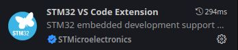

Once installed, configure the extension to point to the correct STM32 tool paths:

1. Back in **Extensions**, click the gear icon next to **STM32 VS Code Extension** and open the settings.
2. Specify the paths to the executables and the `STM32CubeCLT` folder.

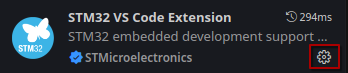

Now we can create our first project to confirm everything is working correctly.

## Hello World

We will send a message over UART from the STM32 and blink the onboard LED.

> *This tutorial is based on the [STM32F411RE](https://www.st.com/en/evaluation-tools/nucleo-f411re.html). Pin assignments may differ on other boards.*

### Generating the Base Code with STM32CubeMX

**STM32CubeMX** is ST’s proprietary software that lets you visually configure the microcontroller (GPIO, SPI, UART, I2C, DMA, etc.) and automatically generate the code.

1. In VSCode, open the **STM32 VS Code Extension** panel.  
   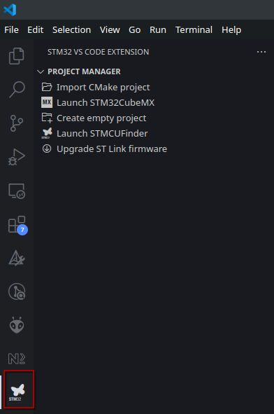

2. Launch **STM32CubeMX** using the dedicated button.  
   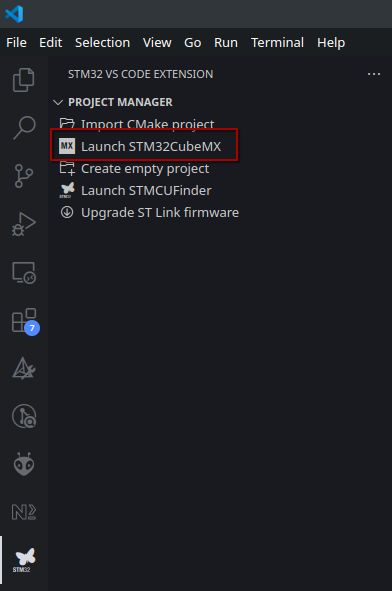

3. Create a new project.  
   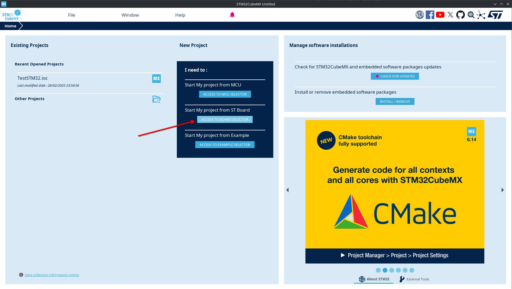

   - Select your board or microcontroller.  
     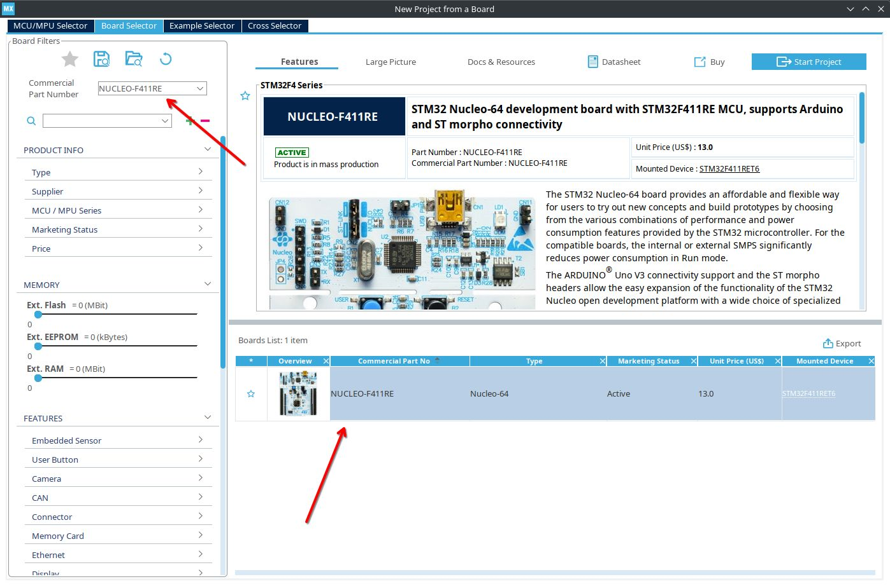

   - Ensure the LED (GPIO) is configured, and note the “User Label.”  
     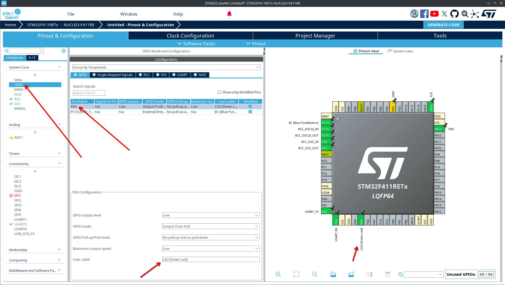

   - Verify that UART is enabled and set to **115200 Baud**.  
     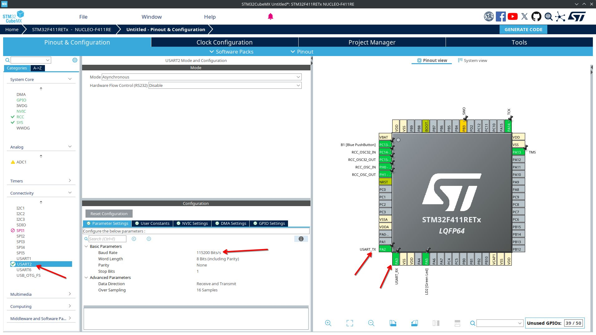

4. In the **Project Manager** tab, name your project and generate the code.  
   > **Important**: Select **CMake** as your toolchain!  
   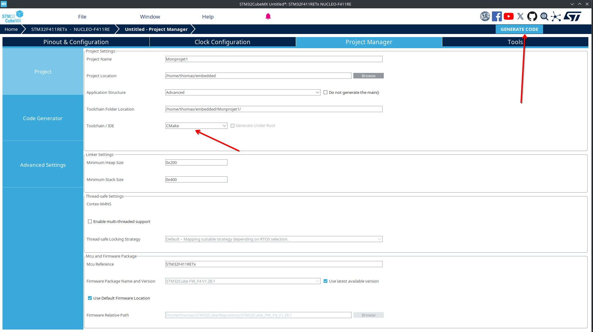

5. Return to VSCode and **import the CMake project**.  
   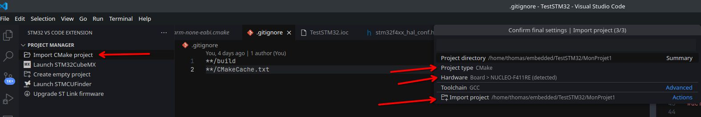

6. Restart VSCode if needed and pick the **Debug** configuration when prompted.

Your IDE is now ready! Let’s write our first firmware.

### First Firmware

We will blink the onboard LED and send a message over UART that includes a variable.  
Find the full code in [this GitHub repository](https://github.com/Ery4z/Blog-STM32HelloWorld).

> **Note**: Place your code between the `USER CODE BEGIN` and `USER CODE END` comments to avoid overwriting when regenerating code with STM32CubeMX.

Two main sections need modification:

#### 1. In `main.c` (Includes section)

```c
/* Private includes ----------------------------------------------------------*/

/* USER CODE BEGIN Includes */

#include <stdio.h>
#include <stdlib.h>
#include <string.h>

/* USER CODE END Includes */
```

#### 2. In the `main` function

```c
int main(void)
{
  /* USER CODE BEGIN 1 */
  /* USER CODE END 1 */

  /* MCU Configuration--------------------------------------------------------*/
  /* Reset of all peripherals, Initializes the Flash interface and the Systick. */
  HAL_Init();

  /* USER CODE BEGIN Init */
  /* USER CODE END Init */

  /* Configure the system clock */
  SystemClock_Config();

  /* USER CODE BEGIN SysInit */
  /* USER CODE END SysInit */

  /* Initialize all configured peripherals */
  MX_GPIO_Init();
  MX_USART2_UART_Init();

  /* USER CODE BEGIN 2 */
  uint8_t counter = 0;
  /* USER CODE END 2 */

  /* Infinite loop */
  /* USER CODE BEGIN WHILE */
  while (1)
  {
    char buffer[64];
    snprintf(buffer, sizeof(buffer), "Hello World! %d\r\n", counter);
    HAL_UART_Transmit(&huart2, (uint8_t*)buffer, strlen(buffer), HAL_MAX_DELAY);

    HAL_GPIO_TogglePin(LD2_GPIO_Port, LD2_Pin);
    HAL_Delay(100);
    HAL_GPIO_TogglePin(LD2_GPIO_Port, LD2_Pin);
    HAL_Delay(200);

    HAL_GPIO_TogglePin(LD2_GPIO_Port, LD2_Pin);
    HAL_Delay(100);
    HAL_GPIO_TogglePin(LD2_GPIO_Port, LD2_Pin);
    HAL_Delay(1000);

    counter++;
    /* USER CODE END WHILE */

    /* USER CODE BEGIN 3 */
  }
  /* USER CODE END 3 */
}
```

### Flashing and Debugging

Compile and flash your STM32 by starting the **debugger** in VSCode:

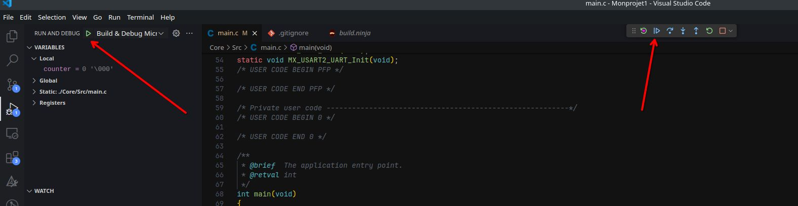

### Viewing the UART Output

1. Install the `screen` utility (or `minicom`, etc.).
2. Identify the port under `/dev/` (often `ttyACM0`).
3. Run:

```bash
screen /dev/ttyACM0 115200
```

You should see your messages appear:

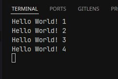

And that’s it! You have successfully set up your STM32 programming environment on Fedora 41 with VSCode.
