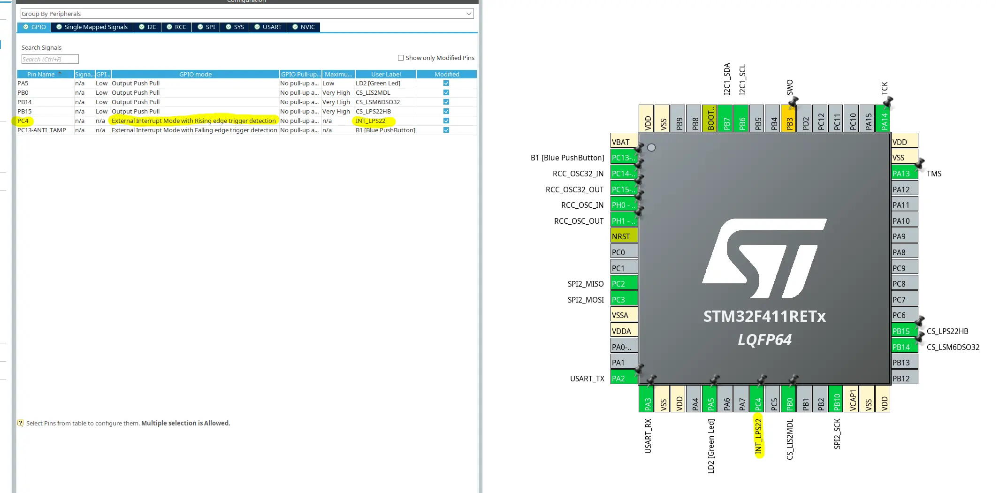
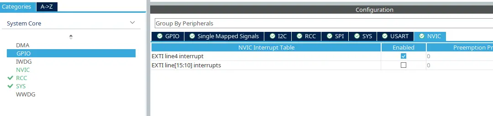
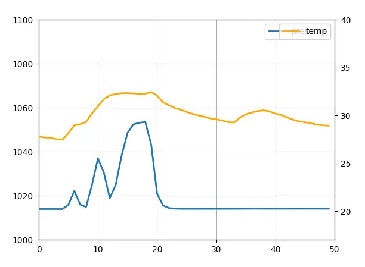

# Introduction

After dealing with the challenges of SPI connections on a breadboard, it was time to tackle a more technical challenge: implementing a reliable driver for the LPS22HB pressure and temperature sensor using EXTI (External Interrupt) handling on an STM32 F411.

In this article, I'll share my experience, tips, and provide a practical example of implementation.

# Configuring EXTI Interrupts with CubeMX

Using interrupts (EXTI) is crucial to reducing processor load and improving system responsiveness. Here's how I configured the GPIO pins in EXTI mode using STM32CubeMX:



Once the GPIO pin are set inside CubeMX as interrupt inputs, this is not ready yet. We need to configure the [NVIC](https://www.st.com/resource/en/product_training/STM32G4-System-Nested_Vectored_Interrupt_Control_NVIC.pdf) which is the interrupt orchestrator in stm32 to allow our newly wired interrupt to actually be enabled:



## Why Use EXTI?

EXTI mode enables automatic actions as soon as the sensor indicates that data (temperature or pressure) is ready, thereby avoiding unnecessary repeated polling.

# Writing the Driver in C

The LPS22HB driver I developed supports both burst reading (simultaneous pressure and temperature readings) and interrupt handling. The configuration structure is flexible, allowing easy selection of sampling frequency, low-pass filtering, and interrupt mode:

```c
LPS22HB_Config_t lps_config = {
    .interupt_mode = LPS22HB_CONFIG_INTERRUPT_MODE_DATA_READY,
    .odr = LPS22HB_CONFIG_ODR_25HZ,
    .lp_bw = LPS22HB_CONFIG_LP_BW_ODR_9,
};
```

This driver leverages the interrupt handling configured earlier via CubeMX, enabling efficient real-time sensor data retrieval.

It's necessary to add this callback to interpret interrupts in the USER CODE BLOCK 4:

```c
/* USER CODE BEGIN 4 */

void HAL_GPIO_EXTI_Callback(uint16_t GPIO_Pin)
{
    if (GPIO_Pin == INT_LPS22_Pin)
    { // same pin as configured above
        lps22hb_data_ready = true;
    }
}

/* USER CODE END 4 */
```

# Reading Data Using a Python Script

To test and validate my implementation, I created a simple Python script to read real-time data from the sensor via UART (or USB) connection.

Here’s a glimpse of the resulting graphical data:



Thanks to the EXTI interrupt, these curves demonstrate excellent stability and responsiveness to actual physical variations in measured parameters.

# Conclusion and Next Steps

[The source code is available here](https://github.com/B33low/STFlight/blob/main/firmware/sensor_drivers/lps22hb.c).

Combining correct configuration via CubeMX and careful implementation of the driver in C results in a robust and efficient system. EXTI interrupts are particularly valuable for real-time applications where responsiveness and energy efficiency are critical.

In upcoming articles, I'll demonstrate how to integrate this driver into the broader flight computer firmware and further optimize overall system performance.
