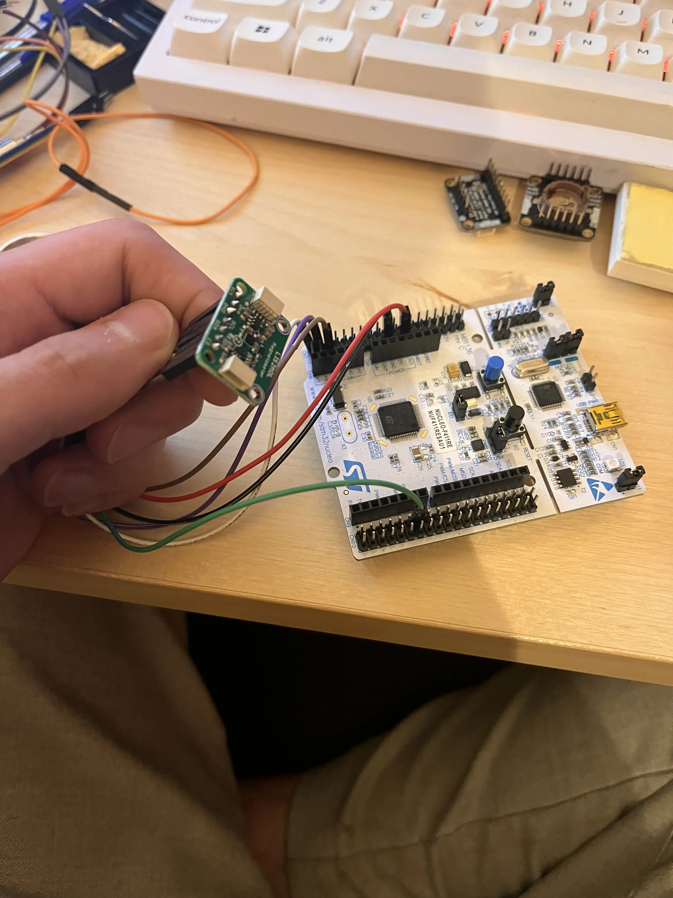

## Context

A few weeks ago, I decided to dive into building a flight computer based on the STM32 F411. Unfortunately, writing the drivers hasn’t gone exactly as planned.

I’ll probably write separate posts about each sensor in the coming weeks, but this one is dedicated to the **non-trivial issues** I’ve run into so far.

## My SPI Experience on a Breadboard

I started off trying to recreate a pseudo-PCB setup on a breadboard: one SPI bus for MOSI, MISO, and SCLK, with separate lines for each CS pin.

To anyone even *thinking* about doing this — **don’t**. Maybe my jumper wires were just bad quality, but either way, I lost both sleep and hair over this.

## Problems I Ran Into

### Interference Between CS and MOSI

Early in my testing, I noticed that when the wires for Chip Select (CS) and Master Out Slave In (MOSI) were too close together — less than 2 cm — interference occurred. This completely broke communication with the sensor.

What made it worse was how unclear the issue was. When I tried reading the WHO_AM_I registers, I’d just get 0x00 or 0xFF — every time. No way to tell whether the sensor itself was dead or just miswired.

### Wobbly Breadboard Connections

Even running at under 1 Mbps, the breadboard setup was a nightmare. The mechanical contacts between the wires and the breadboard headers were just not reliable, leading to insanely noisy measurements. There was really no way to tell whether the data I was getting was accurate or total garbage.

## What I Tried to Fix It

### Switching to Direct Wiring

To deal with the instability, I ditched the breadboard and used direct **jumper wire connections** from the STM32 Nucleo-64 to the sensor. It wasn’t a perfect fix, but it significantly improved signal quality. The more direct wiring helped reduce interference and made the connections more solid.

### Considering a Custom SPI Shield

After this whole ordeal, I started thinking seriously about designing a dedicated **SPI shield**. It would offer a few key benefits:

- **Less interference:** cleaner wiring layout would reduce the risk of signal cross-talk between CS, MOSI, etc.
- **More reliable connections:** sturdy, well-thought-out headers would mean more dependable communication.
- **Easy expansion:** the shield could make it easier to add multiple sensors on the same SPI bus without compromising signal integrity.

That said, I still need to finish writing my drivers for each sensor to finalize the wiring setup before building anything permanent.

## Diagrams & Photos

To help visualize the setup and changes I made, here are a few images:

*Diagram showing the original setup and the interference issue.*

*Photo of the setup after switching to direct wiring.*
