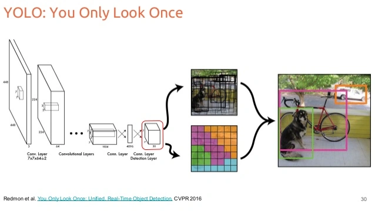
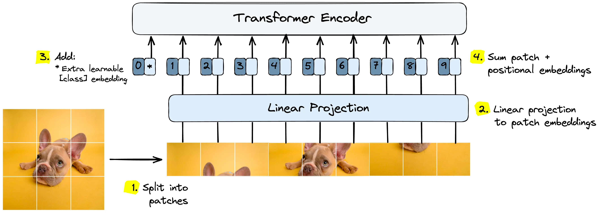
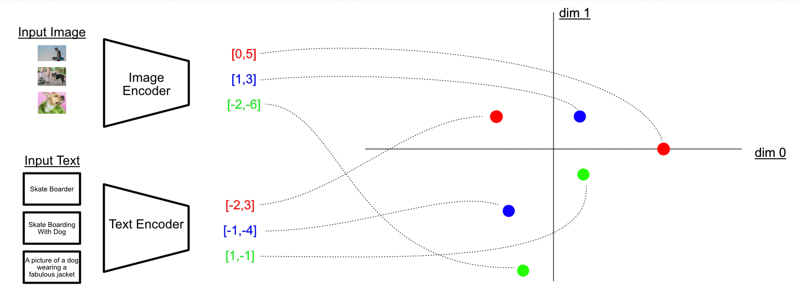
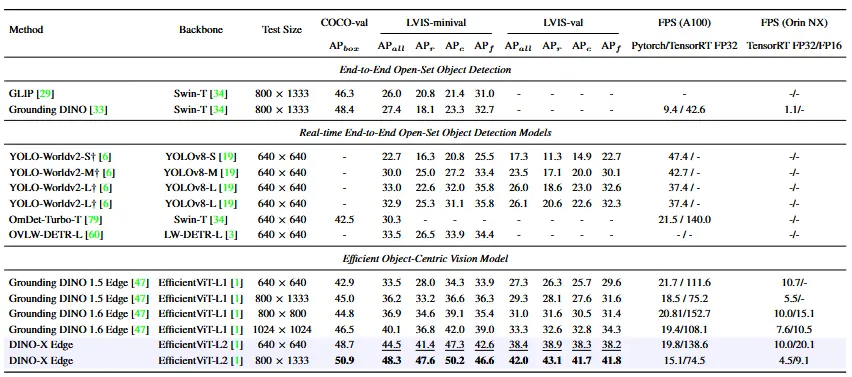
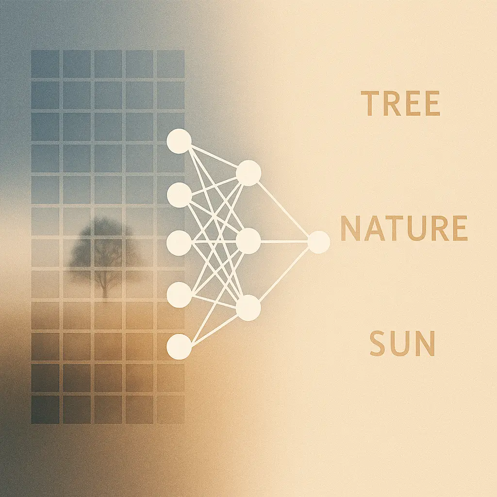

# Des CNNs aux Transformers Visuels : une décennie de bouleversements en vision par ordinateur

En **2025**, les **Transformers visuels** sont devenus la nouvelle référence en vision par ordinateur.  Tout le monde en parle, mais c’est intéressant de revenir un peu en arrière pour comprendre comment on en est arrivé là.

---

## L’ère des CNN

Pendant les **années 2010**, la vision par ordinateur a connu un bond gigantesque.  Quand **AlexNet** a remporté le concours ImageNet en **2011**, cela a lancé l’ère du deep learning appliqué à l’image.  À partir de là, les **CNN** ont tout dominé. La recherche a progressé pas à pas avec des modèles comme **VGG**, **ResNet**, puis **YOLO**, qui ont rendu la détection d’objets *accessible* à presque tout le monde.

Je pense encore que **YOLO** a été une petite révolution : un système de détection presque plug-and-play, open source, facile à adapter, performant sans nécessiter une machine hors de prix.  On pouvait entraîner un modèle sur son propre jeu de données et obtenir des résultats corrects en quelques jours. C’est ce qui a rendu la vision artificielle si accessible aux chercheurs indépendants et aux bidouilleurs.

Mais il y avait toujours un goulot d’étranglement : **les données**.

Les performances d’un modèle dépendent directement de la qualité et de la représentativité du **jeu de données d’entraînement**.  Par exemple, si vous entraînez YOLO à détecter des chats et des chiens, mais que votre dataset contient **1 chien pour 9 chats**, le modèle apprendra probablement que « tout animal à quatre pattes est un chat ».  Résultat : 90 % de précision, mais un modèle totalement biaisé.

Cet exemple est trivial, mais les choses deviennent vite compliquées quand les classes sont plus subtiles.  Imaginons que vous entraîniez un modèle à reconnaître **“proie”** et **“prédateur”**.  Si vous collectez vos données en Europe, vous verrez des renards, des lapins, des cerfs...  Mais votre classe “proie” représentera en réalité des *proies européennes*.  Le modèle plantera dès qu’il verra un kangourou ou un jaguar.  Pour être vraiment performant, il faudrait collecter des données *partout dans le monde*, et surtout **les annoter à la main**.

Et c’est là que le bât blesse : l’annotation.  Dessiner des boîtes, écrire des labels, corriger les erreurs… c’est un travail humain énorme.  Une seule annotation mal placée, et les performances globales peuvent s’en ressentir.  C’est la rançon de l’apprentissage supervisé.

---

## L’arrivée des Transformers

Puis est arrivé **2017**, avec le papier *[Attention Is All You Need](https://arxiv.org/abs/1706.03762)*.  Les **Transformers**, à la base, étaient des modèles de **traitement du texte**, et ils ont tout changé, non pas en ajoutant de la complexité, mais en supprimant la convolution.

Au lieu d’extraire des caractéristiques localement, le Transformer utilise le **self-attention** pour apprendre quelles parties de l’entrée sont importantes.  Moins d’hypothèses faites à la main, plus de flexibilité, et une architecture qui s’adapte mieux à la quantité de données.

Au début, on les utilisait pour des tâches de **langage** : traduction, résumé, génération de texte.  Mais très vite, l’idée a contaminé le monde de la vision.

En **2019**, certains ont commencé à insérer des blocs d’attention dans des architectures de type ResNet.  Et en **2020**, le **Vision Transformer (ViT)** a vu le jour.  Il découpait les images en *patches*, les traitait comme des mots, et utilisait le même mécanisme d’attention que dans le texte.  Résultat : **des performances de pointe**, à condition d’avoir suffisamment de données et de puissance de calcul.

C’est là que tout a basculé : on ne définissait plus à la main ce qui importait, le modèle pouvait l’apprendre tout seul, à condition d’avoir le budget GPU qui va avec.

---

## La multimodalité et Grounding DINO

Avançons jusqu’à aujourd’hui : place à **Grounding DINO** et à la **multimodalité**.

La **multimodalité**, c’est le fait de combiner des données de natures différentes, par exemple image + texte, radar + vision, audio + texte, pour enrichir la compréhension du modèle.  Quand j’écrivais mon mémoire de master en **2021**, le sujet était déjà brûlant.  On m’avait demandé de créer un dataset **vision–radar** pour entraîner un **Transformer vision–radar** capable de suivre des véhicules en 3D.   C’était sympa, mais le vrai vainqueur a été la combinaison **texte–image**.

Et ça, c’est facile à comprendre.

Montrez une photo d’un voilier à un modèle purement visuel : il dira juste “bateau”. Mais combinez-le avec un modèle de texte entraîné sur des milliards de documents, et il saura qu’une **voile** est généralement blanche, placée **au-dessus** de la **coque**, et que l’ensemble forme un **bateau** utilisé sur **l’eau**.  Cette passerelle sémantique entre mots et pixels, c’est ce qui rend les modèles multimodaux si puissants : ils apprennent des *concepts*, pas seulement des formes.

---

## Pourquoi c’est vraiment important

L’impact concret, c’est qu’on n’a plus besoin d’annoter manuellement des milliers d’images pour chaque nouvelle classe.Tant que le **concept** existe déjà dans le modèle de texte (et qu’il n’est pas trop exotique), le modèle peut le reconnaître **sans réentraînement**, c’est ce qu’on appelle le *zero-shot learning*.

Autrement dit, on n’est plus limité aux classes définies pendant l’entraînement.  On peut littéralement **changer la consigne à la volée**, simplement en modifiant la phrase de détection.  
J’ai fait un petit test :  j’ai fait tourner **Grounding DINO** sur une vidéo de drone FPV et j’ai changé la classe à détecter *en plein vol*. Le modèle est passé sans accroc de "peinture" à “personnes”, puis à "casque vr", en temps réel.  

Ce genre de flexibilité était impensable il y a encore quelques années.

---

## Où on en est aujourd’hui

Actuellement, **Grounding DINO** est l’un des meilleurs modèles **open source** de détection vision–langage.  
Il existe des variantes plus récentes comme **GroundingDINO 1.5** ou **GroundingDINO-X**, mais elles sont **fermées**, donc peu exploitables pour expérimenter librement.

---

Si les **années 2010** étaient consacrées à *détecter les objets*, les **années 2020** cherchent à *comprendre ce qu’ils sont*, et pour la première fois, les modèles commencent vraiment à **comprendre le contexte** de ce qu’ils voient.

