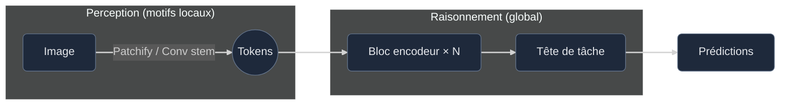
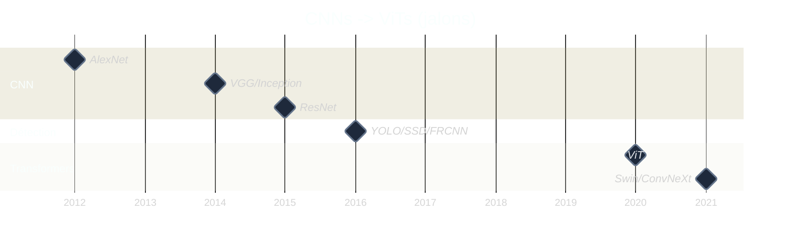

# Les réseaux de neurones convolutifs sont-ils morts ? Vive les CNN !

En **2025**, les Transformers s’imposent comme choix par défaut. Pour autant, dès qu’il s’agit de déployer avec un budget CPU minuscule ou sur un appareil embarqué capricieux, les **convolutions** rappellent leur efficacité. Ce billet propose un tour rapide — pas un papier académique — pour répondre simplement à la question : « Les CNN, c’est fini ? »

---

## Les années CNN

En 2012, **AlexNet** bouleverse ImageNet : soudain, les GPU deviennent centraux pour la vision et les architectures à convolutions s’empilent comme des LEGO. Suivent **VGG** (plus profond), **Inception** (plus astucieux), **ResNet** (enfin entraînable), puis **YOLO**, qui fait entrer la détection d’objets dans le domaine du faisable « en soirée » sans drame.

Ce qui distingue **YOLO**, ce n’est pas seulement la vitesse : c’est l’approche. Poids ouverts, configurations simples, « voilà comment adapter à _vos_ données ». Pas besoin de cluster : un plan et de la rigueur suffisent.

Reste toutefois un adversaire constant : **le jeu de données**.

Si des chiens sont sous-représentés face aux chats **(1 pour 9)**, le modèle apprend « quatre pattes → probablement un chat » et affiche quand même **90 % de précision**. Belle note au benchmark, article validé… jusqu’au premier corgi. Quand les classes deviennent floues (_prédateur vs proie_), « jeu de données mondial » signifie souvent « forêt européenne, parce que c’est ce qu’on avait comme données en stock». Au premier kangourou, le modèle hésite.

Quant à l’annotation, c’est le prix de l’apprentissage supervisé : boîtes, masques, attributs — des heures de travail pour quelques milliers d’images. Un seul rectangle approximatif, et la précision dérive en silence.

---

## Pourquoi les convolutions restent souvent la bonne idée

Les convolutions fonctionnent par petites touches locales, répétées. Elles ne cherchent pas à comprendre l’image d’un seul coup ; elles composent : bords → coins → parties → objets. Ce **biais inductif** est un atout, surtout quand priment **latence**, **mémoire** et **prévisibilité**.

Formule au cœur du procédé :

$$
O(i,j) = \sum_{u,v} K(u,v) \cdot I(i-u, j-v)
$$

Kernel classique de détection de bords :

$$
\begin{bmatrix}
-1 & -1 & -1 \\\\
 2 &  2 &  2 \\\\
-1 & -1 & -1
\end{bmatrix}
$$

En pratique : on applique un petit motif local et on somme. En empilant ces couches, on reproduit une grande partie des débuts de la vision par ordinateur. C’est simple et efficace.

Sur CPU modeste ou GPU embarqué, un CNN soigné offre souvent une **latence faible**, une **mémoire stable** et des **chaînes de déploiement** mûres (quantification, compilateurs, kernels). Pour de nombreuses tâches courantes, cela suffit.

---

## Ce que changent les Transformers

Les Transformers ne partent pas du local : ils regardent _partout_ d’emblée. C’est idéal lorsque la tâche est **globale** (documents, structures à longue portée en imagerie médicale, télédétection, vidéo). Ils montent aussi très bien en échelle grâce aux données et au pré-entraînement. En présence d’un grand backbone préentraîné, le transfert est souvent excellent.

Des limites existent toutefois : ils apprécient les **gros volumes de données** (ou un pré-entraînement massif) et sollicitent davantage le matériel. Avec un budget de latence « microcontrôleur de machine à café », l’écart se ressent.

---

## Pourquoi les CNN n’ont pas gardé la couronne

Les CNN n’ont pas « perdu » ; ils ont surtout **atteint un plafond** sur certains cas.

- **Raisonnement global difficile avec du local pur.** Le champ réceptif croît avec la profondeur, mais les dépendances longues restent coûteuses à apprendre.
- **Profondeur/largeur : rendements décroissants.** Au-delà d’un point, beaucoup de FLOPs pour peu de gain.
- **Transfert qui plafonne.** L’ImageNet aide, mais si la tâche cible diffère (document, aérien, médical), l’avantage s’érode.
- **Les Transformers ont débloqué l’échelle.** Self-attention + pré-entraînement massif (souvent multimodal) facilitent la généralisation inter-domaines.

En bref : les CNN sont des **spécialistes** à fort biais inductif ; les Transformers des **généralistes** capables de vision globale.

---

## Hybrides : la voie du milieu qui part en production

L’attention « pure » n’est pas une obligation. De nombreux backbones modernes combinent les idées :

- **Conv-stem + blocs d’attention** : localité d’abord, raisonnement global ensuite.
- **Attention fenêtrée/hiérarchique** : principalement local, global à la demande.
- **CNN « façon Transformer »** : normalisations, grands kernels, recettes d’entraînement plus robustes.

**Atouts en pratique**

- Meilleure **latence** qu’un ViT pur en edge, meilleure **précision** qu’un CNN pur sur des tâches globales.
- **Stabilité d’entraînement** accrue par rapport aux premiers ViT ; **déploiement** plus simple que des dorsales géantes.
- Compatibilité naturelle avec la **quantification** et les runtimes existants.

Parmi les familles représentatives : _Swin_, _ConvNeXt_, _CoAtNet_, et d’autres variantes conv–attention. L’essentiel tient en trois mots : **biais local + contexte global**.

---

## Performance et efficacité (le point pragmatique)

L’attention adore les tokens ; son coût croît avec eux.

- **Convolution** : coût qui suit la taille image et le kernel ; mémoire prévisible ; kernels très optimisés.
- **Self-attention** : **quadratique** en tokens (version standard) ; contexte global fort, mais vigilance sur **latence** et **RAM**.

**Mémo edge**

  <table className="min-w-full text-sm">
    <thead className="text-slate-200">
      <tr>
        <th className="text-left py-2 px-3">Enjeu</th>
        <th className="text-left py-2 px-3">CNN</th>
        <th className="text-left py-2 px-3">Transformer</th>
      </tr>
    </thead>
    <tbody className="text-slate-300">
      <tr className="border-t border-slate-700/40">
        <td className="py-2 px-3">Latence (CPU)</td>
        <td className="py-2 px-3">✅ Souvent plus faible</td>
        <td className="py-2 px-3">⚠️ Souvent plus élevée sans optimisations</td>
      </tr>
      <tr className="border-t border-slate-700/40">
        <td className="py-2 px-3">Pics mémoire</td>
        <td className="py-2 px-3">✅ Stables</td>
        <td className="py-2 px-3">⚠️ Peuvent grimper avec les tokens</td>
      </tr>
      <tr className="border-t border-slate-700/40">
        <td className="py-2 px-3">Quantification</td>
        <td className="py-2 px-3">✅ Chaînes d’outils matures</td>
        <td className="py-2 px-3">↔️ En progrès, encore sensible</td>
      </tr>
      <tr className="border-t border-slate-700/40">
        <td className="py-2 px-3">Petits jeux de données</td>
        <td className="py-2 px-3">✅ Le biais inductif aide</td>
        <td className="py-2 px-3">⚠️ Préfère le pré-entraînement</td>
      </tr>
      <tr className="border-t border-slate-700/40">
        <td className="py-2 px-3">Contexte global</td>
        <td className="py-2 px-3">↔️ Limité sans artifices</td>
        <td className="py-2 px-3">✅ Point fort natif</td>
      </tr>
    </tbody>
  </table>

**Petit Transformer pertinent** : budget GPU disponible, documents/télédétection, ou backbone préentraîné réutilisable.
**CNN/hybride préférable** : latence/énergie contraintes, peu de données annotées, mémoire prévisible et déploiement simple.

---

## Un court « moment visuel »

La détection de bords figure parmi les premiers motifs appris par un CNN. Un simple filtre de Sobel suffit à faire ressortir les contours — preuve que la **structure locale** raconte déjà une histoire. Les Transformers raisonnent globalement, mais la perception débute souvent par des motifs et du contraste.

D’où l’intérêt des **biais inductifs** : un CNN capte rapidement des signaux locaux récurrents.

---

## Multimodalité (là où les Transformers excellent)

En associant image, texte, audio ou télémétrie, les Transformers apprennent un espace latent commun où « cette image ↔ cette légende » prend sens : classification zero-shot, recherche sémantique, et autres usages avancés. Les CNN gardent leur place (via des hybrides), mais le raisonnement global et la structuration en tokens avantagent naturellement les Transformers.

---

## « Que choisir, concrètement ? »

- **Latence serrée / device réduit / peu d’annotations** → **CNN** ou **hybride avec conv-stem**.
- **Contexte global / dépendances longues / gros pré-entraînement** → **Transformer**.
- **Cas indécis** → **petit hybride** (conv-stem + blocs d’attention) : bon compromis.

Un dernier rappel : aucune architecture ne rattrape un jeu de données bancal. Échantillonnage, équilibre des classes, et évaluation exigeante font la différence.

---

## Une petite chronologie

---

## Mot de la fin

Les **CNN** ne sont pas morts : ce sont des **spécialistes**.
Les **Transformers** sont des **généralistes** qui scalent, agrègent des modalités et offrent une vision globale.

En présence d’un gros pré-entraînement et de Multimodalité, le Transformer s’impose.
Pour un système rapide, léger et robuste sur de l'embarqué, un CNN soigné reste le choix pragmatique.

Le plus souvent, la solution la plus saine consiste en un **petit modèle hybride** qui respecte le budget… et les données.
