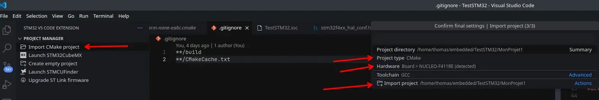

## À propos

Dans cet article, nous allons mettre en place un environnement pour programmer des STM32 en C via [VSCode](https://code.visualstudio.com/). Nous allons intégrer les outils fournis par STMicroelectronics afin de générer facilement le code nécessaire au développement d’un firmware.

## Prérequis

- L’éditeur [VSCode](https://code.visualstudio.com/)
- Un compte sur le site de [STMicroelectronics](https://www.st.com)
- [STM32CubeMX](https://www.st.com/en/development-tools/stm32cubemx.html)
- [STM32CubeCLT](https://www.st.com/en/development-tools/stm32cubeclt.html)
- [ST-MCU-FINDER-PC](https://www.st.com/en/development-tools/st-mcu-finder-pc.html)

## Installation

> **Attention** : Ne vous précipitez pas lors de l’installation ! La plupart des problèmes proviennent d’erreurs liées aux chemins d’installation des différentes dépendances.

### Outils STM32

Dans un premier temps, nous allons installer les outils propriétaires de ST afin de pouvoir interagir facilement avec le microcontrôleur :

- **STM32CubeMX** et **ST-MCU-FINDER-PC** s’installent via des installateurs graphiques. Notez bien le chemin d’installation (généralement `~/STM32CubeMX` et `~/ST-MCU-FINDER-PC`).
- **STM32CubeCLT** s’installe via un script qui crée par défaut le dossier `/opt/ST/STM32CubeCLT`.

### VSCode

Après avoir installé VSCode, configurons les outils :

1. Ouvrir l’onglet **Extensions**.
2. Installer l’extension **STM32 VS Code Extension**.


Une fois l’extension installée, il faut la configurer pour indiquer les chemins d’accès aux outils STM32 installés :

1. Dans **Extensions**, cliquer sur la roue dentée à côté de **STM32 VS Code Extension** et ouvrir les **Paramètres**.
2. Renseigner les chemins vers les exécutables et vers le dossier `STM32CubeCLT`.


La configuration étant terminée, nous allons créer notre premier projet pour vérifier le bon fonctionnement de l’ensemble.

## Hello World

Notre objectif est d’envoyer un message via l’UART depuis notre STM32 et de faire clignoter la LED intégrée.

> *Cette partie du tutoriel utilise la carte [STM32F411RE](https://www.st.com/en/evaluation-tools/nucleo-f411re.html). Selon votre carte, la configuration peut différer.*

### Génération du code de base avec STM32CubeMX

**STM32CubeMX** est le logiciel de ST qui permet de configurer graphiquement un microcontrôleur puis de générer automatiquement le code associé (GPIO, SPI, UART, I2C, DMA, etc.).

1. Dans VSCode, ouvrir l’onglet **STM32 VS Code Extension**.  
   

2. Lancer **STM32CubeMX** via le bouton dédié.  
   

3. Créer un nouveau projet.  
   

   - Sélectionner la carte ou le microcontrôleur concerné.  
     

   - Vérifier la configuration de la LED (GPIO) et noter le “User Label”.  
     

   - Vérifier que l’UART est bien activé et configuré en **115200 Baud**.  
     

4. Dans l’onglet **Project Manager**, choisir le nom du projet et générer le code.  
   > **Important** : Sélectionner **CMake** comme toolchain !  
   

5. De retour dans VSCode, **importer le projet CMake**.  
   

6. Redémarrer VSCode si nécessaire et sélectionner la configuration **Debug**.

L’IDE est prêt ! Passons à l’écriture de notre premier firmware.

### Premier firmware

Nous allons faire clignoter la LED intégrée et envoyer un message sur l’UART, incluant une variable.  
Le code complet est disponible sur [ce dépôt GitHub](https://github.com/Ery4z/Blog-STM32HelloWorld).

> **Attention** : Écrivez votre code entre les balises `USER CODE BEGIN` et `USER CODE END` pour éviter d’éventuelles suppressions par STM32CubeMX.

Deux modifications principales sont nécessaires :

#### 1. Dans `main.c` (section **Includes**)

```c
/* Private includes ----------------------------------------------------------*/

/* USER CODE BEGIN Includes */

#include <stdio.h>
#include <stdlib.h>
#include <string.h>

/* USER CODE END Includes */
```

#### 2. Dans la fonction `main`

```c
int main(void)
{
  /* USER CODE BEGIN 1 */
  /* USER CODE END 1 */

  /* MCU Configuration--------------------------------------------------------*/
  /* Reset of all peripherals, Initializes the Flash interface and the Systick. */
  HAL_Init();

  /* USER CODE BEGIN Init */
  /* USER CODE END Init */

  /* Configure the system clock */
  SystemClock_Config();

  /* USER CODE BEGIN SysInit */
  /* USER CODE END SysInit */

  /* Initialize all configured peripherals */
  MX_GPIO_Init();
  MX_USART2_UART_Init();

  /* USER CODE BEGIN 2 */
  uint8_t counter = 0;
  /* USER CODE END 2 */

  /* Infinite loop */
  /* USER CODE BEGIN WHILE */
  while (1)
  {
    char buffer[64];
    snprintf(buffer, sizeof(buffer), "Hello World! %d\r\n", counter);
    HAL_UART_Transmit(&huart2, (uint8_t*)buffer, strlen(buffer), HAL_MAX_DELAY);

    HAL_GPIO_TogglePin(LD2_GPIO_Port, LD2_Pin);
    HAL_Delay(100);
    HAL_GPIO_TogglePin(LD2_GPIO_Port, LD2_Pin);
    HAL_Delay(200);

    HAL_GPIO_TogglePin(LD2_GPIO_Port, LD2_Pin);
    HAL_Delay(100);
    HAL_GPIO_TogglePin(LD2_GPIO_Port, LD2_Pin);
    HAL_Delay(1000);

    counter++;
    /* USER CODE END WHILE */

    /* USER CODE BEGIN 3 */
  }
  /* USER CODE END 3 */
}
```

### Flash et débogage

Pour compiler et flasher votre STM32, lancez le **debugger** dans VSCode :


### Visualiser l’UART

1. Installez l’utilitaire `screen` (ou `minicom`, etc.).
2. Repérez le port sous `/dev/` (souvent `ttyACM0`).
3. Lancez la commande :

```bash
screen /dev/ttyACM0 115200
```

Vous verrez alors s’afficher les messages.


Félicitations ! Votre environnement pour programmer des STM32 sous Fedora 41 avec VSCode est désormais opérationnel.
```
