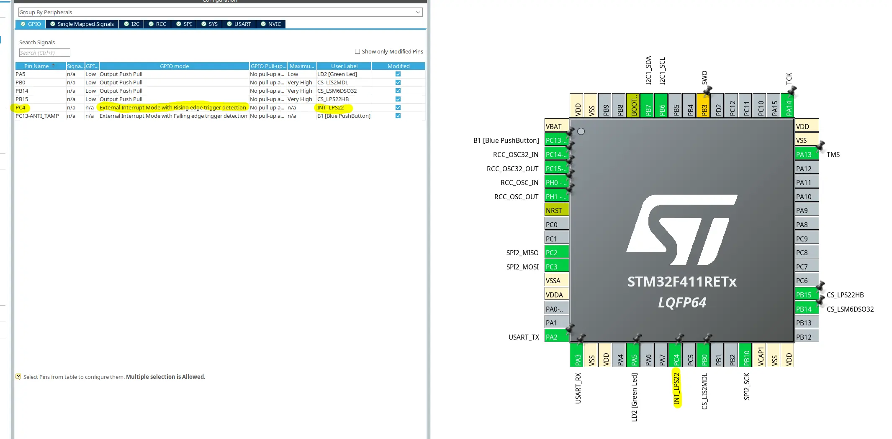
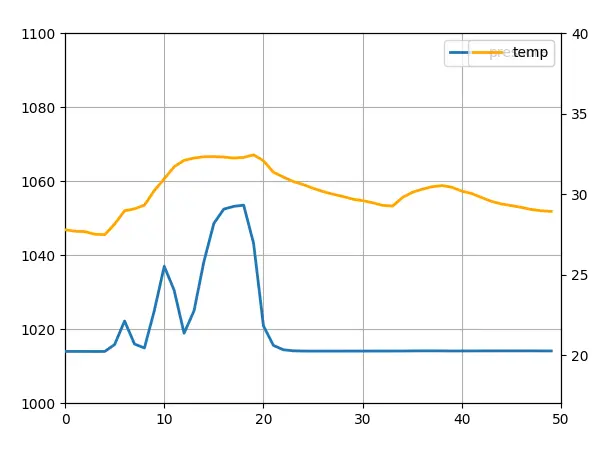

# Contexte

Après avoir passé par les affres des connexions SPI sur breadboard, il était temps de s'attaquer à un véritable défi technique : l'implémentation d'un driver pour le capteur LPS22HB (pression et température) avec gestion des interruptions EXTI sur un STM32 F411.

Dans cet article, je partage mon expérience, quelques astuces, et un exemple concret d'utilisation.

# Configuration des interruptions EXTI avec CubeMX

L'utilisation d'interruptions (EXTI) est essentielle pour réduire la charge processeur et améliorer la réactivité du système. Voici comment j'ai configuré les GPIO en mode EXTI à l'aide de STM32CubeMX :



*Configuration de mes ports dans CubeMX.*


*Configuration du NVIC.*

## Pourquoi utiliser EXTI ?

Le mode EXTI permet de déclencher des actions automatiques dès que le capteur indique qu'une donnée est prête (température ou pression), évitant ainsi des lectures inutiles répétées en polling.

# Écriture du driver en C

Le driver du LPS22HB que j'ai développé supporte à la fois la lecture des données en burst (pression et température simultanément) et l'utilisation des interruptions. La structure de configuration est flexible, permettant facilement de choisir la fréquence d'échantillonnage, le filtrage passe-bas, ainsi que le mode interruption :

```c
LPS22HB_Config_t lps_config = {
    .interupt_mode = LPS22HB_CONFIG_INTERRUPT_MODE_DATA_READY,
    .odr = LPS22HB_CONFIG_ODR_25HZ,
    .lp_bw = LPS22HB_CONFIG_LP_BW_ODR_9,
};
```

Ce driver utilise la gestion des interruptions configurée précédemment via CubeMX, permettant de récupérer efficacement les données du capteur en temps réel.

Il est nécéssaire de rajouter ce callback afin d'interpréter les intérruptions dans le USER CODE BLOCK 4.

```c
/* USER CODE BEGIN 4 */

void HAL_GPIO_EXTI_Callback(uint16_t GPIO_Pin)
{
    if (GPIO_Pin == INT_LPS22_Pin)
    { // same pin as above
        lps22hb_data_ready = true;
    }
}

/* USER CODE END 4 */
```

# Lecture des données via script Python

Pour tester et valider mon implémentation, j'ai développé un petit script Python permettant de lire en temps réel les données issues du capteur via une connexion UART (ou USB).

Voici un aperçu des résultats graphiques obtenus :



*Courbes de measure d'examples.*


Grâce à l'interruption EXTI, les courbes affichent une excellente stabilité et réactivité aux variations réelles des paramètres physiques mesurés.

# Conclusion et prochaines étapes

[Le code source est trouvable ici](https://github.com/B33low/STFlight/blob/main/firmware/sensor_drivers/lps22hb.c)

La combinaison d'une configuration correcte via CubeMX et d'une implémentation soignée du driver en C permet d'obtenir un système robuste et efficace. Les interruptions EXTI s'avèrent particulièrement utiles pour des applications en temps réel où la réactivité et l'économie d'énergie sont cruciales.

Dans les prochains articles, je présenterai comment intégrer ce driver au reste du firmware de mon ordinateur de vol, et comment optimiser davantage les performances globales du système.

