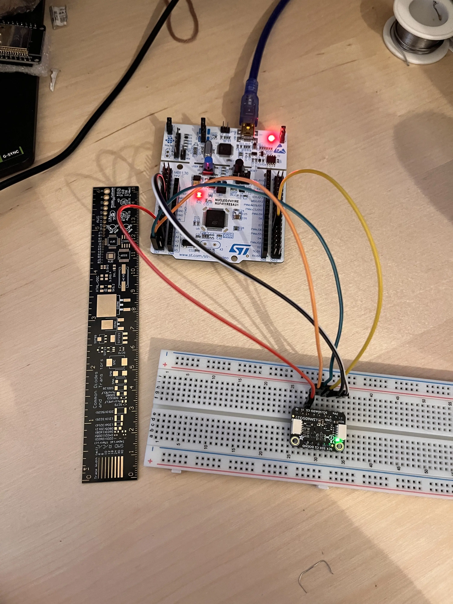
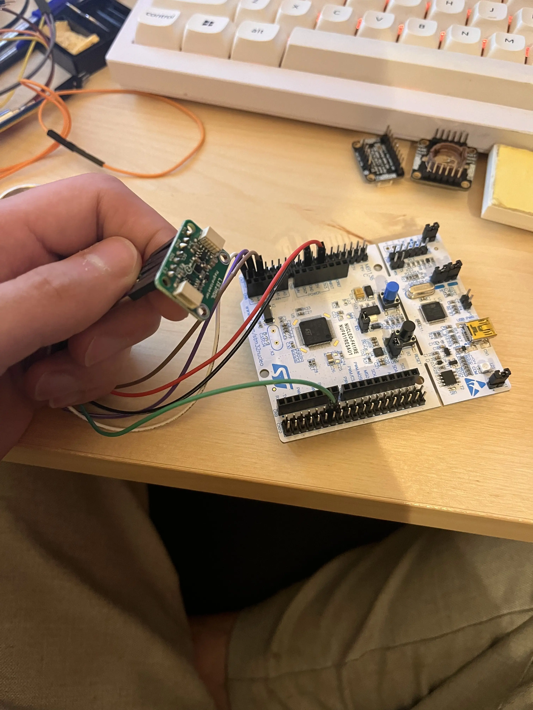

# Contexte

J'ai décidé il y a quelques semaines de me lancer dans la réalisation d'un ordinateur de vol basé sur un STM32 F411. Malhereusement l'écriture des drivers ne s'est pas passé comme prévu.

Je pense écrire dans les prochaines semaines des articles dédié aux differents capteurs, mais celui ci sera dédié aux soucis non triviaux que j'ai pu rencontrer.

# Mon expérience de la connection SPI sur breadboard

Dans un premier temps j'ai voulu créer une structure sur une breadboard afin de simuler un pcb, à savoir un bus SPI pour MOSI MISO SCLK et des traces différentes pour les différentes pour les différentes CS.

À tous ceux qui peuvent en avoir l'idée, je ne recommande pas de le faire sur une breadboard, peut-être que mes cables étaient de faible qualité, mais ce qui est certain c'est que j'y ai perdu des cheveux et des heures de sommeils.

## Problèmes rencontrés

### Interférences entre CS et MOSI

Au début de mes tests, j'ai constaté que lorsque les fils reliant le CS (Chip Select) et le MOSI (Master Out Slave In) étaient trop proches (moins de 2 cm), des interférences se produisaient. Ces interférences perturbaient la communication et rendaient le capteur totalement inopérant. 

Malheureusement ce n'était pas clair. Après branchement et lors de tentative de lecture des differents registres WHO_AM_I, je lisais toujours 0x00 ou 0xFF. Impossible de savoir si le capteur était défaillant ou non. 

### Instabilité des connexions sur breadboard

Même en opérant à un débit inférieur à 1 Mbps, l'utilisation de la breadboard s'est avérée problématique. Les contacts mécanique entre les cables et les connecteurs de la breadboard n'étaient vraiment pas robuste, résultant en des mesure très bruités sans vrai possibilités de savoir que les données renvoyé par le capteur n'étaient pas correctes.

## Solutions et améliorations

### Passage à une connexion directe

Pour remédier aux problèmes d'instabilité, j'ai remplacé la breadboard par des **jumper wire** direct reliant le Nucleo 64 STM32 au capteur. Cette solution a notablement amélioré la qualité de la connexion, bien qu'elle ne soit pas encore parfaite. Le montage direct permet de réduire les interférences et d'améliorer la robustesse des contacts.

### Besoin d'un shield SPI dédié

Fort de ces expérimentations, j'en suis venu à envisager la nécessité de développer un **shield SPI** spécialement dédié. Un tel shield offrirait plusieurs avantages :
- **Réduction des interférences :** en organisant soigneusement le câblage, le risque d'interférence entre les fils (CS, MOSI, etc.) serait minimisé.
- **Stabilité accrue :** des connexions robustes et bien conçues garantiraient une transmission des données plus fiable.
- **Extension aisée :** en permettant de connecter plusieurs capteurs sur le même bus SPI sans compromettre la qualité de la communication.

Cependant avant de le réaliser je dois finir d'implémenter mes drivers pour chaque capteurs afin d'être certain du cablage.

## Illustrations et diagrammes

Pour mieux comprendre les enjeux et les modifications apportées, je vous propose quelques visuels :

*Schéma illustrant le montage initial et le problème d'interférence.*

*Photo du montage après connection direct du senseur.*

